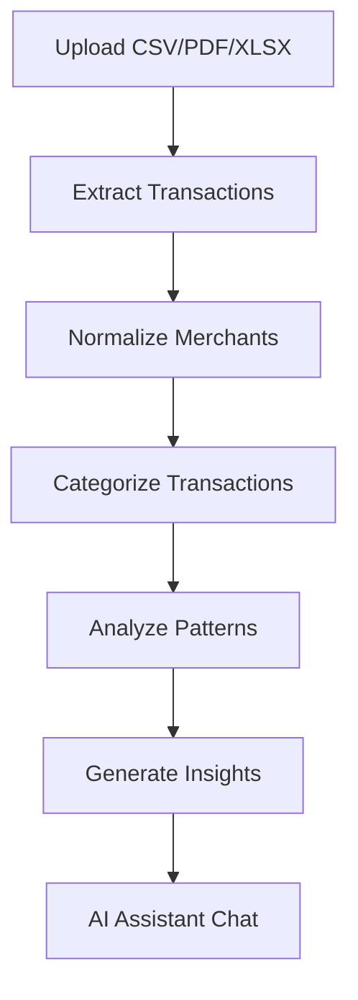

# Expense Analyzer

> **Understand your money. Not just track it.**

Expense Analyzer is an AI-powered personal finance analysis platform focused initially on **Indian users**.

Unlike traditional expense trackers that primarily answer *"How much did I spend?"*, Expense Analyzer aims to answer:

> **"Where is my money going, why is it changing, and what should I do about it?"**

The platform ingests financial statements, extracts and normalizes transactions, analyzes spending behavior, detects recurring expenses and anomalies, and provides a natural-language interface for querying personal financial data.

---

## 🚧 Project Status

**Status:** Active Development (Phase 2 - Asynchronous Processing)

This project is currently in active development with a working Spring Boot backend implementing core domain entities, repositories, observability, and asynchronous processing pipelines.

---

# 1. Vision

The long-term vision is to build a **personal AI financial analyst**.

A user should be able to provide several months of financial data and receive insights such as:

> Your spending increased 18% this month, primarily because of shopping and food delivery.
>
> You have 7 recurring subscriptions costing approximately ₹2,140/month.
>
> Your spending is consistently higher during the last week of the month.
>
> You spent ₹42,600 on your car during the last 12 months.
>
> Reducing dining expenses by ₹3,000/month would save approximately ₹36,000/year.

The system combines **deterministic financial calculations** with **AI-powered interpretation**.

---

# 2. Goals

## Primary Goals

* Import financial statements from multiple sources (CSV, PDF, Excel)
* Extract transactions reliably
* Preserve original transaction information
* Normalize merchants
* Automatically categorize transactions
* Detect recurring expenses
* Analyze spending patterns
* Detect unusual spending
* Compare current spending with historical behavior
* Provide useful financial insights
* Support natural-language financial queries
* Maintain strong privacy and security

---

# 3. Non-Goals for the Current Implementation

The following are intentionally deferred:

* Direct integration with every Indian bank
* Real-time bank transaction synchronization
* Investment portfolio management
* Tax filing
* Loan management
* Insurance management
* Automated financial transactions
* Payments
* Financial advice requiring regulated advisory capabilities

---

# 4. Target Users

The initial target audience is individuals who have financial data spread across:

* Bank accounts
* Credit cards
* Debit cards
* UPI
* Cash
* Multiple financial institutions

---

# 5. India-First Considerations

The implementation focuses on transaction formats and financial behavior common in India:

* UPI transactions
* Indian bank statements
* Credit-card statements
* Debit-card transactions
* EMIs
* SIPs
* Insurance premiums
* Rent
* Utility payments
* Fuel
* Subscriptions
* Merchant-specific transaction formats (e.g., `SWIGGY*ONLINE`)

---

# 6. Core User Journey



---

# 7. Example Questions

Users can ask:

* How much did I spend on Swiggy this year?
* Why did I spend more this month?
* What are my top 5 spending categories?
* How much do I spend on subscriptions?
* Which subscriptions do I have?
* What were my unusual expenses this month?
* How much did I spend on my car last year?
* If I reduce dining by ₹3,000 per month, how much will I save annually?

---

# 8. High-Level Architecture

```mermaid
graph TB
    subgraph Clients
        Web App
        Mobile App
        Chat Interface
    end
    
    subgraph Infrastructure
        CDN/WAF --> API Gateway
        API Gateway --> User Service
        API Gateway --> Statement Service
        API Gateway --> Transaction Service
    end
    
    subgraph Processing
        Event Bus
        Document Worker
        Enrichment Worker
        Analytics Worker
    end
    
    subgraph Core Services
        Analysis Service
        AI/LLM Service
        Notification Service
    end
    
    subgraph Data Layer
        PostgreSQL --> Transaction Storage
        Redis --> Cache
        Object Storage --> Statements
    end
    
    Clients --> Infrastructure
    Infrastructure --> Processing
    Processing --> Core Services
    Core Services --> Data Layer
```

---

# 9. Major Components

## User Service

Responsible for:
* Authentication (JWT-based)
* User profile management
* Preferences configuration
* Authorization enforcement

## Statement Service

Responsible for:
* Statement uploads
* File metadata management
* Processing status tracking
* Duplicate detection via checksums
* Object storage references

## Document Processing

Responsible for:
* CSV parsing
* PDF parsing (text-based/structured)
* Excel parsing
* Transaction extraction
* Data validation

## Transaction Service

Responsible for:
* Transaction persistence
* Transaction retrieval
* Transaction updates
* Merchant association
* Category association
* Transaction search and filtering

## Enrichment

Responsible for:
* Merchant normalization
* Transaction categorization (rule-based initially)
* Confidence scoring
* Recurring transaction detection
* Anomaly detection

## Analytics Service

The **source of truth for financial calculations**. Responsible for:
* Spending summaries
* Category analysis
* Merchant analysis
* Trends and historical comparisons
* Recurring expenses
* Anomaly detection
* Cash-flow analysis

## AI / LLM Service

Responsible for:
* Natural-language queries
* Query interpretation
* Financial-context retrieval
* Insight explanation
* Summaries and recommendations

**Important:** The AI layer should not independently calculate financial facts when those facts can be obtained from structured data.

---

# 10. Data Architecture

Domain entities implemented:

```text
User
 ├── Account
 │    └── Transaction
 ├── Statement
 ├── RecurringExpense
 ├── Insight
 ├── AIQuery
 └── AuditLog

Transaction --> Merchant
Transaction --> Category
Category --> Category (parent)
Statement --> Account
```

A transaction preserves both raw and normalized information:

| Field | Description |
|-------|-------------|
| `raw_description` | Original merchant description (e.g., "SWIGGY*ONLINE") |
| `merchant_id` | Normalized merchant identifier |
| `category_id` | Assigned category |
| `amount` | Transaction amount (decimal precision) |
| `currency` | Currency code (INR, USD, etc.) |
| `confidence_score` | Classification confidence (0.0-1.0) |

---

# 11. Technology Stack

## Backend

```text
Java 21
Spring Boot
Spring Security
Spring Data JPA
Spring Kafka
Spring Cloud Stream
PostgreSQL
Docker
```

## Frontend

```text
React / Next.js
```

## Infrastructure

```text
Kubernetes (optional)
MinIO (object storage)
Prometheus + Grafana (observability)
OpenTelemetry (distributed tracing)
```

---

# 12. Development Phases

## Phase 0 — Product Definition ✅ Complete

* Product requirements documented
* Personas and use cases defined
* MVP scope established
* Non-goals explicitly stated

## Phase 1 — Architecture ✅ Complete

* High-Level Design (HLD) documented
* Low-Level Design (LLD) documented
* API contracts defined
* Database model designed
* Event model designed
* Security model implemented

## Phase 2 — Foundation 🚧 In Progress

* Repository setup complete
* Spring Boot application configured
* Docker Compose ready
* PostgreSQL database configured
* Authentication service implemented
* CI/CD pipelines configured

## Phase 3 — Statement Processing 🚧 In Progress

* File upload functionality
* Object storage integration (MinIO)
* CSV parser implemented
* Transaction extraction pipeline
* Async processing with Kafka

## Phase 4 — Transaction Intelligence ⏳ Planned

* Merchant normalization
* Category system
* Categorization service
* Recurring expense detection
* Duplicate detection

## Phase 5 — Analytics ⏳ Planned

* Spending summaries
* Trend analysis
* Category analytics
* Anomaly detection
* Cash-flow analysis

## Phase 6 — AI Integration ⏳ Planned

* Natural-language queries
* Tool calling for financial data
* Insight generation
* Guardrails and safety

## Phase 7 — UI Development ⏳ Planned

* Dashboard
* Upload interface
* Transaction explorer
* Insights view
* AI chat interface

---

# 13. Project Structure

```text
expense-analyzer/
├── backend/                          # Spring Boot application
│   ├── src/main/java/com/expenseanalyzer/
│   │   ├── account/                  # Account domain & API
│   │   ├── ai/                       # AI/LLM integration
│   │   ├── analytics/                # Financial analytics
│   │   ├── audit/                    # Audit logging
│   │   ├── auth/                     # Authentication service
│   │   ├── category/                 # Category domain
│   │   ├── common/                   # Shared utilities
│   │   ├── config/                   # Application configuration
│   │   ├── enrichment/               # Transaction enrichment
│   │   ├── insight/                  # Insights generation
│   │   ├── merchant/                 # Merchant domain
│   │   ├── messaging/                # Kafka integration
│   │   ├── notification/             # Notification service
│   │   ├── observability/            # Actuator, tracing
│   │   ├── processing/               # Document processing
│   │   ├── statement/                # Statement management
│   │   ├── transaction/              # Transaction domain & API
│   │   └── user/                     # User domain & API
│   └── src/test/java/...             # Unit & integration tests
├── docs/                             # Documentation
│   ├── api/                          # API documentation
│   ├── architecture/                 # HLD, LLD, ADRs
│   ├── backlog/                      # Product backlog
│   ├── domain/                       # Domain model
│   └── events/                       # Event model
├── frontend/                         # React application (WIP)
├── infrastructure/                   # Docker configs, scripts
└── README.md
```

---

# 14. Key Documentation

| Document | Description |
|----------|-------------|
| [MVP Requirements](docs/product/MVP-REQUIREMENTS.md) | Functional and non-functional requirements |
| [Domain Model](docs/domain/DOMAIN-MODEL.md) | Entity relationships and database schema |
| [High-Level Design](docs/architecture/HLD.md) | System architecture overview |
| [Low-Level Design](docs/architecture/LLD.md) | Detailed component design |
| [Event Model](docs/events/EVENT-MODEL.md) | Event definitions and flow |
| [Security Requirements](docs/architecture/SECURITY-REQUIREMENTS.md) | Security architecture |

---

# 15. Development Principles

### 1. Correctness over complexity

Financial calculations must be correct.

### 2. Data is the source of truth

The database and deterministic analysis layer are authoritative.

### 3. AI explains; it does not invent

LLMs should operate on verified data.

### 4. Privacy by design

Minimize exposure of financial information.

### 5. Async where appropriate

Long-running workloads should not block API requests.

### 6. Idempotency everywhere it matters

Retries must not create duplicate financial records.

### 7. Observable systems

If we cannot understand what the system is doing, it is not production-ready.

---

# 16. Testing Strategy

* **Unit Tests** - Domain logic, calculations, parsers
* **Integration Tests** - Database, messaging, APIs
* **Contract Tests** - Service APIs, event schemas
* **Resilience Tests** - Failure scenarios, duplicate handling
* **Performance Tests** - Concurrent uploads, analytics latency

---

# 17. Contributing

Contributions are welcome! Please follow these guidelines:

1. Fork the repository
2. Create a feature branch (`git checkout -b feature/amazing-feature`)
3. Commit your changes with clear messages
4. Push to your branch (`git push origin feature/amazing-feature`)
5. Open a Pull Request

---

# 18. License

License to be determined.

---

## Acknowledgments

* Built with ❤️ for Indian users who want better financial insights
* Inspired by personal finance management best practices

🤖 Generated with [Claude Code](https://claude.com/claude-code)
